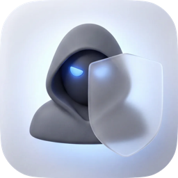
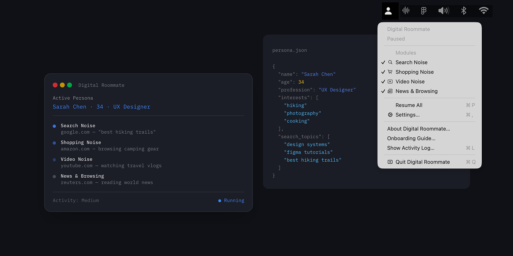

<p align="center">
  
</p>
<h1 align="center">Digital Roommate</h1>
<p align="center">A macOS menu bar app that generates realistic web traffic from a fake persona<br>— poisoning ISP-level and data-broker profiling of your household.</p>
<p align="center"><strong>v1.0</strong> · macOS 14+ · Apple Silicon & Intel</p>
<p align="center"><a href="https://github.com/madebysan/digital-roommate/releases/latest"><strong>Download Digital Roommate</strong></a></p>

---

<p align="center">
  
</p>

## Your ISP sees a second person. You stay invisible.

Digital Roommate creates a "pattern of life" for a fictional person who shares your network. Your ISP and data brokers see traffic that looks like another person lives in your house — with different interests, different browsing habits, and a different schedule.

This is **network-level obfuscation**, not website-level bot evasion. The goal is to make your household's aggregate traffic look like 2+ people, not to fool individual websites.

## Modules

The app runs hidden browser sessions in the background using time-aware scheduling. Each module simulates a different aspect of daily browsing:

| Module | What it does |
|--------|-------------|
| **Search Noise** | Runs searches on Google, Bing, and DuckDuckGo using the persona's interests. Sometimes does multi-query research bursts. Clicks through to results to create realistic browsing trails. |
| **Shopping Noise** | Browses Amazon — searches for products, views product pages, scrolls through images and reviews. Creates the impression of an active online shopper. |
| **Video Noise** | Watches YouTube videos from the persona's interests. Plays muted, watches variable durations (30–90% of each video), and skips ads automatically. |
| **News & Browsing** | Visits news sites, reads articles at realistic speed, and occasionally follows related links. Covers general, tech, hobby, and professional sites. |

All traffic is driven by a configurable persona — a JSON file that defines the roommate's interests, profession, shopping habits, and schedule.

## How it works

### Traffic generation

- **Offscreen WKWebViews** — Real WebKit browser engine with JavaScript execution and cookie persistence. Web views are positioned offscreen (not destroyed between actions), so sites see normal browser behavior. Pool capped at 3 concurrent views by default.
- **Isolated cookie stores** — Each module gets its own persistent `WKWebsiteDataStore` (keyed by module ID). The search persona and shopping persona don't leak into each other, and none of them touch your personal browser.
- **Anti-detection JS** — Overrides `navigator.webdriver` to return `undefined`, normalizes plugin/MIME-type arrays to non-empty values, and spoofs the Page Visibility API so background tabs (YouTube) don't pause. WebGL fingerprint normalization is implemented but intentionally disabled — on Apple Silicon it was creating a *more* unique fingerprint than the default.

### Scheduling

- **Poisson-distributed timing** — Inter-activity delays use an exponential distribution (`-ln(U) × mean`), which produces the irregular spacing of real human browsing rather than fixed intervals.
- **Time-of-day weighting** — Activity probability varies by time block (morning, afternoon, evening, late night). Includes a "Vampire mode" weight for occasional 2–5 AM activity.
- **Weekend/weekday variation** — Weekends use different interval multipliers: later mornings, shifted activity peaks.

### Hardening

- **Safari-only user agents** — Each new WebView gets a random Safari UA (17.3–18.3 on Sonoma/Sequoia). Safari UAs are chosen because WKWebView's TLS ClientHello fingerprint (JA3/JA4) matches Safari/WebKit — using Chrome or Firefox UAs would create an obvious mismatch detectable by any TLS fingerprinting middlebox.
- **HTTPS-only** — App Transport Security is enforced. No plaintext HTTP traffic that would expose full URL paths to passive observers.
- **URL scheme allowlist** — Only `http` and `https` schemes are permitted. `file://`, `javascript:`, and `data:` URLs are rejected at the WebView level before loading.
- **Blocked domain enforcement** — Checked in all four modules before initiating navigation *and* as a safety net in the WebView's `decidePolicyFor` delegate. Double-layered.
- **JS injection escaping** — User-provided strings (persona interests, blocked domains) injected into WebView JavaScript are escaped for backticks, `${}` template expressions, null bytes, and `</script>` breakout sequences.
- **Thread-safe logging** — Activity log writes are serialized through a dedicated `DispatchQueue` to prevent data races when multiple modules run concurrently. Console output is compiled out in release builds (`#if DEBUG`).

## What it doesn't do

- Won't fool Google reCAPTCHA or Amazon's bot detection
- Won't bypass CAPTCHAs or create accounts
- Won't interact with your personal browsing or cookies
- Won't send any data to any server — traffic is outbound only

## Known limitations

### TLS fingerprinting

WKWebView's TLS ClientHello has a known JA3/JA4 fingerprint that matches Safari/WebKit. The app uses Safari-only UAs to keep the TLS-to-UA mapping consistent, but an observer performing active TLS fingerprint analysis (not just passive hostname logging) can identify all WKWebView traffic as coming from the same engine. This is effective against bulk ISP-level profiling; it is not effective against targeted TLS inspection.

### DNS visibility

All hostname lookups are standard plaintext DNS visible to your ISP. Even with HTTPS, every hostname the app resolves is exposed. If DNS privacy matters to you, configure system-level DNS-over-HTTPS via [NextDNS](https://nextdns.io), [Cloudflare WARP](https://1.1.1.1), or a macOS DoH profile.

### Sandbox

The app runs without macOS App Sandbox (`com.apple.security.app-sandbox = false`). This is required for WKWebView to function with isolated data stores and custom configurations. WKWebView's own multi-process architecture provides process-level isolation for web content, but a WebKit exploit would have a larger attack surface than in a sandboxed app.

## Installation

### From DMG (recommended)

1. Download the latest `.dmg` from [Releases](../../releases)
2. Open the DMG and drag **Digital Roommate** to Applications
3. Launch from Applications — it appears in the menu bar, not the Dock

### From source

```bash
git clone https://github.com/madebysan/digital-roommate.git
cd digital-roommate
swift build -c release
# Binary at .build/release/DigitalRoommate
```

## Usage

### First launch

A 5-step onboarding wizard walks you through setup:

1. **Welcome** — what the app does
2. **Modules** — toggle which traffic types to generate
3. **Activity level** — Low / Medium / High with sessions-per-hour estimates
4. **Persona** — meet your fake roommate
5. **Summary** — review and start

The scheduler doesn't start until you click "Get Started."

### Menu bar

Click the person icon in the menu bar to:
- See module status and current activity
- Toggle individual modules on/off
- Pause/Resume all activity
- Enable Launch at Login
- Open the activity log

### Settings

Sidebar layout with 7 sections:

| Section | What you configure |
|---------|-------------------|
| **General** | Activity level, active time blocks, max concurrent browsers, launch at login |
| **Search** | Search engine toggles (Google, Bing, DuckDuckGo), burst mode, click-through |
| **Shopping** | Products per session, image browsing, review scrolling |
| **Video** | Max watch duration, ad skipping, mute |
| **News** | Articles per session, sites per session, follow related links |
| **Sites & Privacy** | Visited sites list, blocked domains |
| **Persona** | Active persona picker, randomize, export, reset, edit interests/topics/categories |

### Choose your noise level

| Level | Sessions/hour | Character |
|-------|--------------|-----------|
| **Low** | ~2–3 | Minimal bandwidth. Quiet roommate. |
| **Medium** | ~5–8 | Moderate presence. Good starting point. |
| **High** | ~10–15 | Significant traffic. Heavy browser. |

Timing follows a Poisson distribution — more active in the afternoon and evening, quieter at night, with different patterns on weekends.

### Persona

Personas are stored in `~/Library/Application Support/DigitalRoommate/personas/` and define:

- **Search topics** — categories, query templates, and items to search for
- **Shopping categories** — Amazon search terms and product URLs
- **Video interests** — YouTube channels, queries, and specific video URLs
- **News sites** — homepages to visit with article reading simulation
- **Active hours** — weight (0.0–1.0) for each time block

Manage from Settings > Persona: switch between personas, randomize, export as JSON, or edit interests inline.

### Activity log

JSON log at `~/Library/Application Support/DigitalRoommate/activity-log.json` — records what module did what and when.

## Architecture

```
Sources/DigitalRoommate/
├── main.swift                    # Entry point
├── AppDelegate.swift             # Lifecycle, App Nap prevention
├── Core/
│   ├── BrowsingEngine.swift      # Offscreen WKWebView pool
│   ├── WebViewInstance.swift      # WKWebView wrapper, URL/scheme validation
│   ├── Scheduler.swift           # Poisson-distributed, time-aware scheduling
│   ├── ModuleRegistry.swift      # Module lifecycle management
│   └── BrowsingModule.swift      # Protocol for all modules
├── Modules/
│   ├── SearchNoiseModule.swift   # Google/Bing/DDG search + click-through
│   ├── ShoppingNoiseModule.swift # Amazon browsing
│   ├── VideoNoiseModule.swift    # YouTube watching, ad skip, watch history
│   └── NewsModule.swift          # News reading, link following
├── Persona/
│   ├── Persona.swift             # Codable model + multi-persona storage
│   ├── PersonaGenerator.swift    # Random persona generation
│   ├── PersonaSchedule.swift     # Time-based activity weighting
│   └── QueryGenerator.swift      # Template-based search queries
├── Settings/
│   ├── AppSettings.swift         # User-configurable settings (Codable)
│   └── SettingsManager.swift     # Singleton persistence (UserDefaults)
├── UI/
│   ├── Styles.swift              # Design tokens, card builders
│   ├── StatusBarController.swift # Menu bar icon and dropdown
│   ├── SettingsWindowController.swift  # Sidebar settings
│   ├── OnboardingWindowController.swift # 5-step onboarding
│   └── HelpWindowController.swift      # About window
├── Persistence/
│   └── StateStore.swift          # JSON state + thread-safe activity log
├── Testing/
│   ├── TestRunner.swift          # Test framework
│   ├── TestConfig.swift          # Test configuration
│   ├── TestPersonas.swift        # Test fixtures
│   └── MockWebViewInstance.swift # WKWebView mock
└── AntiDetection/
    ├── UserAgentProvider.swift    # Safari UA rotation (17.3–18.3)
    └── StealthScripts.swift      # Navigator + visibility spoofing
```

## Privacy

- All browsing in isolated WKWebViews — your personal cookies and history are never touched
- No data sent to any server — outbound web traffic to public sites only
- Activity log stays local
- No analytics, telemetry, or phone-home behavior
- Zero third-party dependencies — Apple frameworks only

## Requirements

- macOS 14.0 (Sonoma) or later
- No external dependencies## License

[MIT](LICENSE)

---

Made by [santiagoalonso.com](https://santiagoalonso.com)
